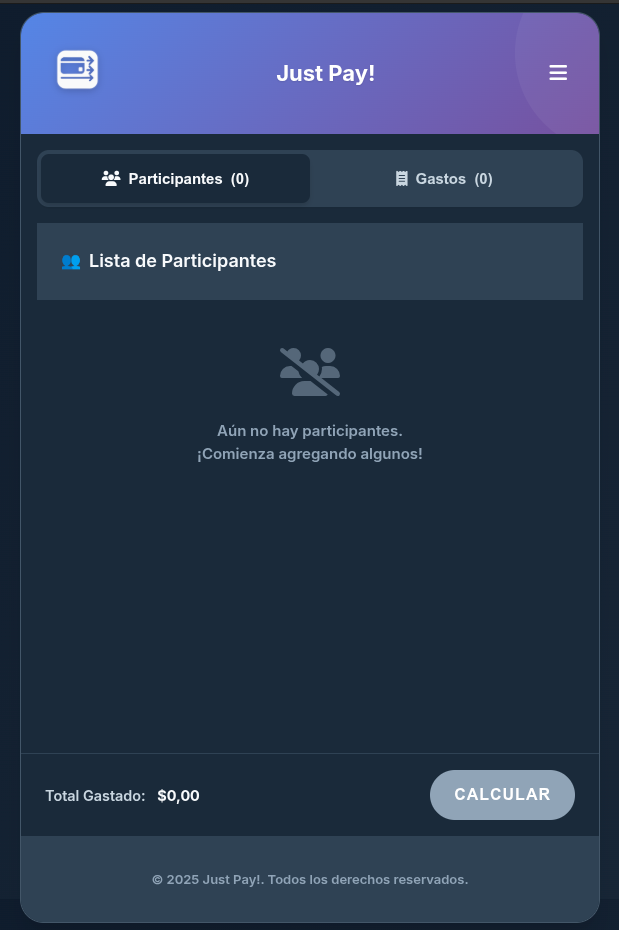

# ✨ Just Pay! - ¡La app para que las cuentas claras conserven la amistad! ✨

    

¿Dividir gastos en grupo es un lío? Ya no más. Con **Just Pay!**, saldar las cuentas es tan fácil como pedir una pizza.

Esta app hace el trabajo sucio por ti: registra quién pagó la birra y quién los snacks, calcula la parte de cada uno y te muestra la forma más simple de transferirse la plata para quedar 100% a mano. ¡Simple, rápido y efectivo!

## 🚀 ¿Qué puedes hacer con Just Pay!?

* **👥 Añadir Participantes:** Agrega a todos los amigos, familiares o compañeros del viaje.
* **💸 Registrar Gastos:** Anota cada gasto, quién lo pagó y si alguien queda excluido (porque no todos comen papitas con cheddar, ¡y se respeta!).
* **📊 Calcular Mágicamente:** Con un solo botón, nuestro algoritmo optimiza las transferencias para que se hagan la menor cantidad de pagos posibles.
* **📲 Compartir los Resultados:** Copia el resumen o compártelo directamente por WhatsApp para que nadie se haga el distraído.
* **💾 Recuerda Todo:** Si cierras la pestaña, ¡no hay problema! La app guarda los datos en tu navegador para que puedas seguir más tarde.

    
    

## ⚙️ ¿Cómo se usa? (Más fácil que pedir delivery)

1.  **Añade a tu gente:** Usa el botón `+` en la pestaña **Participantes**.
2.  **Carga los gastos:** Cambia a la pestaña **Gastos** y usa el botón `+` para registrar cada ticket.
3.  **¡Calcula!:** Toca el botón **"Calcular"** en la barra inferior.
4.  **¡Listo!:** La app te muestra el resultado para que todos se pongan al día.

## 🛠️ Tecnologías y Características

Este proyecto fue construido desde cero utilizando tecnologías web modernas para asegurar una experiencia de usuario rápida, responsiva y funcional.

### Frontend
* **HTML5:** Utilizado para una estructura semántica, accesible y bien organizada.
* **CSS3:** Para todos los estilos, animaciones y el diseño. Se utilizaron características modernas como:
    * **Flexbox y Grid:** Para la maquetación de componentes y la estructura principal.
    * **Variables CSS (Custom Properties):** Para un sistema de diseño temático y fácil de mantener.
    * **Media Queries:** Para lograr un diseño completamente responsivo (Mobile-First).
    * **Animaciones y Transiciones:** Para dar vida a la interfaz y mejorar el feedback al usuario.
* **JavaScript (ES6+):** Es el cerebro de la aplicación. Se usó JavaScript "vanilla" (puro, sin frameworks) para:
    * Manipulación dinámica del DOM.
    * Manejo de todos los eventos e interacciones del usuario.
    * Organización del código en **Módulos JS** (`import`/`export`) para separar la lógica de cálculo de la interfaz.

### Funcionalidades Web Modernas
* **Progressive Web App (PWA):** La aplicación cuenta con un **Web App Manifest (`manifest.json`)** que permite:
    * La **instalación en el dispositivo** (móvil o escritorio) para un acceso directo.
    * Una experiencia de **pantalla completa** al abrirla desde el ícono, simulando una app nativa.
* **Web Storage API (`localStorage`):** Para **guardar automáticamente** la sesión del usuario (participantes y gastos) en el navegador, evitando la pérdida de datos al recargar o cerrar la pestaña.
* **Clipboard API:** Implementada en el botón "Copiar" para una funcionalidad moderna y segura de copiado al portapapeles.

¡Gracias por usar Just Pay! Ahora, a disfrutar sin preocuparse por las cuentas. 😉